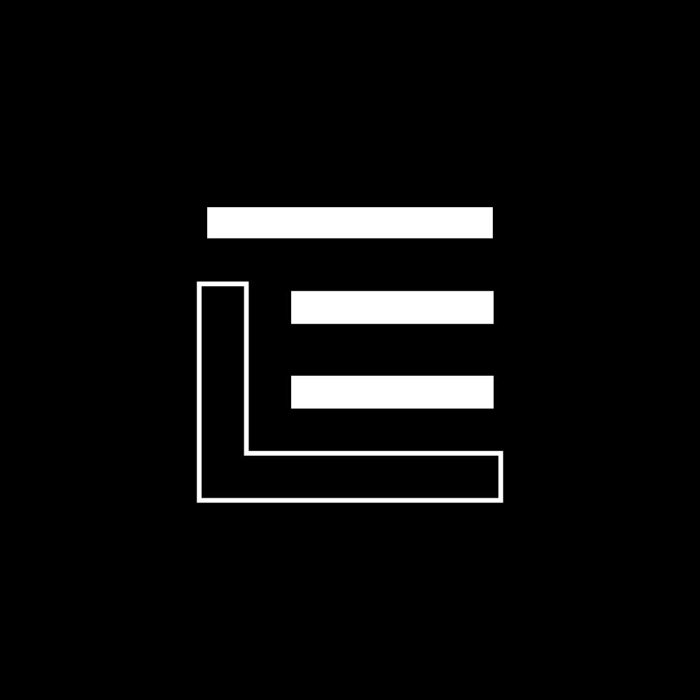

# Ledger — Personal Budget

A private, local-first budgeting app that tracks your daily allowance and banks what you don't spend.

> **▶ [Try the web version live](https://samncg.github.io/ledger/)** — no account needed, works in any browser.

<p align="center">
  
</p>

- **Web app** — React + Vite, works fully offline, data stays in your browser
- **Android app** — native Kotlin + Jetpack Compose port in [`android/`](android/README.md)
- **No account required** — everything is stored on your device; optional Google sign-in syncs between devices

---

## Features

- Daily allowance budgeting with rollover — unspent money carries to the next day
- Optional **bank balance system**: keep a balance, move money into your budget, and bank leftover allowance automatically
- Top-ups & transfers (move to budget · return to balance · add · withdraw)
- Quick-log spending with frequent suggestions, quick amounts, and single-category selection
- **Category breakdown**: donut chart, per-category bars with optional budgets, range filters
- **Spending trend**: line chart with per-category series and a GitHub-style heatmap
- Searchable, filterable, sortable **history** with date grouping
- **Automations**: recurring spending / top-ups / balance rules with automatic backfill
- **Piggy bank**: savings goal with deposits and a break option
- 10 theme presets with full color customization, fonts, compact density, reorderable cards
- **Liquid glass** UI (Android): shader-backed blur, refraction, vibrancy and chromatic aberration on the bottom navigation pill and optional frosted dashboard cards
- JSON backup & CSV export — the backup format is identical across web and Android, so you can move data freely between platforms

## Web app

Requires [Node.js](https://nodejs.org) 18+.

```sh
npm install        # install dependencies
npm run dev        # start the dev server (http://localhost:5173)
```

Production build:

```sh
npm run build      # outputs to dist/
npm run preview    # serve the production build locally
```

### Deploy to GitHub Pages

The build uses a relative base (`base: './'`), so `dist/` works from any sub-path (e.g. `https://yourusername.github.io/ledger/`). Push the contents of `dist/` to your Pages branch/folder, or add a workflow that runs `npm run build` on push.

### Cloud sync (optional)

Sync is Firebase-based and disabled by default — the config lives in [`src/lib/firebase.js`](src/lib/firebase.js). To enable it:

1. Create a project at <https://console.firebase.google.com> and add a web app.
2. Paste its config into the `FIREBASE_CONFIG` block in `src/lib/firebase.js`.
3. In **Authentication → Sign-in method**, enable **Google**.
4. In **Authentication → Settings → Authorized domains**, add the domain the app is served from.
5. Create a **Firestore database** with these rules (also documented in the source):

```
rules_version = '2';
service cloud.firestore {
  match /databases/{database}/documents {
    match /ledger/{uid} {
      allow read, write: if request.auth != null && request.auth.uid == uid;
    }
  }
}
```

> The API keys in the repo are client-side Firebase config — they're meant to be public; your data is protected by the security rules above.

### Smoke tests

The web app ships SSR render tests that catch broken imports or missing wiring:

```sh
npm run smoke
```

## Android app

The native port lives in [`android/`](android/README.md) — open that folder in **Android Studio** and press Run, or build from the CLI:

```sh
cd android
./gradlew assembleDebug   # APK at app/build/outputs/apk/debug/app-debug.apk
```

Requires **JDK 17+**, Android SDK (API 35), and **Kotlin 2.3.0** (the project uses Compose's shader-backed liquid-glass library). The full refraction/blur/vibrancy effects need an emulator or device on **Android API 33+** (AGSL); on API 26–32 the glass degrades to a basic blur.

## Data & privacy

- **Web:** all data is stored in `localStorage` under `ledger-*` keys. Nothing is sent anywhere unless you sign in to cloud sync.
- **Android:** data lives in a local DataStore with the same key layout.
- **Backups:** `ledger-backup` v5 JSON files are byte-compatible between the web and Android apps — export from one, import into the other.

## Project structure

```
ledger/
├── index.html              Vite entry (web)
├── index.html.original     the original single-file app (pre-refactor, kept as reference)
├── src/                    web app source (React)
│   ├── components/         UI components + cards
│   ├── lib/                constants, helpers, Firebase, tilt, sound
│   └── effects/            neko cat + tab-title typewriter
├── scripts/                SSR smoke tests
└── android/                native Android port (Kotlin + Jetpack Compose)
```

## Credits

- Icons: [Feather](https://feathericons.com/)
- Desktop cat: [oneko.js](https://github.com/adryd325/oneko.js)
- Flying piggy bank GIF: [Terraria Wiki](https://terraria.wiki.gg/)
