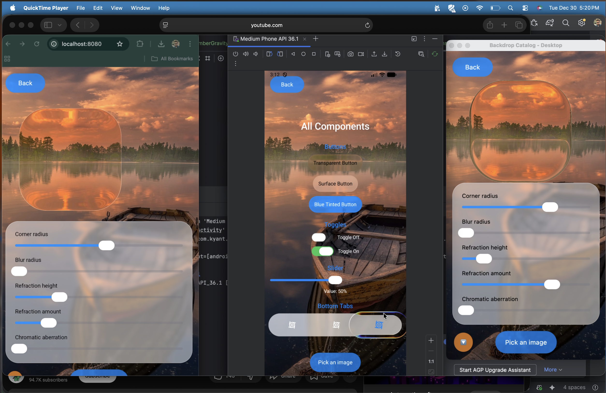

# KMP Liquid Glass

A liquid glass effect library for Compose Multiplatform.

[](https://central.sonatype.com/artifact/io.github.kashif-mehmood-km/backdrop)

> Based on [AndroidLiquidGlass](https://github.com/Kyant0/AndroidLiquidGlass) by Kyant.



## Overview

KMP Liquid Glass lets you create frosted glass UI effects in Compose Multiplatform. The library provides blur, refraction, highlights, and shadow effects that work across Android, iOS, Desktop, and Web.

**Key capabilities:**

- **Blur effects** — Gaussian blur with configurable radius and edge treatment
- **Color adjustments** — Brightness, contrast, saturation, and vibrancy controls
- **Lens refraction** — Glass-like distortion with optional chromatic aberration
- **Dynamic highlights** — Ambient and directional lighting that responds to angle
- **Shadows** — Drop shadows and inner shadows for depth
- **Progressive blur** — Gradient blur for scroll containers

## Installation

```kotlin
commonMain.dependencies {
    implementation("io.github.kashif-mehmood-km:backdrop:0.0.1-alpha02")
}
```

For version catalog:

```toml
[libraries]
backdrop = { module = "io.github.kashif-mehmood-km:backdrop", version = "0.0.1-alpha02" }
```

## Use with Claude Code

This repo is also a [Claude Code](https://claude.com/claude-code) plugin marketplace. Installing the `kmp-liquid-glass` skill teaches Claude (and any agent on Claude Code) the library's mental model, the full effect / component / shader API, and a curated set of recipes — so prompts like *"add a frosted glass tab bar"* or *"make this card iOS-style translucent"* produce correct, idiomatic code on the first try.

### Install

In any Claude Code session, run:

```text
/plugin marketplace add Kashif-E/KMPLiquidGlass
/plugin install kmp-liquid-glass@kmp-liquid-glass-marketplace
```

Then reload plugins (or restart the session):

```text
/reload-plugins
```

### Verify

Ask Claude something the skill should handle, for example:

> Build a glass-style settings dialog using the `backdrop` library — title "Notifications", two toggle rows, Cancel/Save buttons. Heavy frosted look like an iOS alert.

Claude should invoke the `kmp-liquid-glass` skill (you'll see it announce "Using kmp-liquid-glass …") and produce code that uses real APIs from `com.kashif_e.backdrop.*` with the correct effect ordering, dim placement, and z-order.

> **Tip:** the skill is much more reliable when you mention the library by name in your prompt — say "use the backdrop library" or "iOS liquid glass" rather than just "make it glassy". Claude Code currently under-triggers skills for purely visual descriptions.

### What's included

The plugin ships a single skill — [`kmp-liquid-glass`](plugins/kmp-liquid-glass/skills/kmp-liquid-glass/SKILL.md) — with progressive references:

- **`SKILL.md`** — mental model, decision tree, effect ordering rules, 12 pitfalls
- **`references/effects.md`** — every effect with parameter ranges and recipes
- **`references/components.md`** — full recipes for card, button, dialog, toggle, tab bar, search, FAB, sheet handle, sticky list header, scroll container with progressive blur
- **`references/advanced.md`** — SDF shaders, magnifier (combined backdrops), custom `expect`/`actual` shaders, performance tuning
- **`references/platform.md`** — exact API-level behavior matrix per effect, per platform

### Using the skill from other agents

The skill files are plain Markdown, so any agent that reads filesystem skills (Claude Agent SDK, custom harnesses, IDE extensions) can load `plugins/kmp-liquid-glass/skills/kmp-liquid-glass/SKILL.md` directly without going through the Claude Code marketplace.

## How it works

The library uses a two-layer approach:

1. **Backdrop layer** — The content you want to show through the glass (usually an image or gradient)
2. **Glass layer** — The element that samples and applies effects to the backdrop

The backdrop captures its content into a graphics layer. When you draw a glass element, it samples from this captured content and applies your chosen effects.

## Basic usage

### Step 1: Create a backdrop

Use `rememberLayerBackdrop()` to create a backdrop, then apply it to your background content with the `layerBackdrop` modifier:

```kotlin
val backdrop = rememberLayerBackdrop()

Image(
    painter = painterResource(Res.drawable.wallpaper),
    modifier = Modifier.layerBackdrop(backdrop).fillMaxSize()
)
```

### Step 2: Draw glass elements

Use `drawBackdrop` to create glass elements that sample from the backdrop:

```kotlin
Box(
    modifier = Modifier
        .drawBackdrop(
            backdrop = backdrop,
            shape = { RoundedCornerShape(24.dp) },
            effects = {
                blur(16.dp.toPx())
            }
        )
        .size(200.dp)
)
```

The `effects` block is where you define what the glass looks like. You can chain multiple effects together.

## Effects reference

All effects are applied inside the `effects` block of `drawBackdrop`.

### blur

Applies Gaussian blur to the sampled content.

```kotlin
effects = {
    blur(radius = 16.dp.toPx())
}
```

| Parameter | Type | Description |
|-----------|------|-------------|
| `radius` | Float | Blur radius in pixels |
| `edgeTreatment` | TileMode | How to handle edges (default: Clamp) |

### colorControls

Adjusts brightness, contrast, and saturation.

```kotlin
effects = {
    colorControls(
        brightness = 0.1f,    // -1.0 to 1.0
        contrast = 1.2f,      // 0.0 to 2.0
        saturation = 1.5f     // 0.0 to 2.0
    )
}
```

### vibrancy

Applies an iOS-style vibrancy effect that enhances colors.

```kotlin
effects = {
    vibrancy()
}
```

### lens

Creates glass refraction — the "liquid" part of liquid glass. Objects behind the glass appear distorted.

```kotlin
effects = {
    lens(
        refractionHeight = 24.dp.toPx(),
        refractionAmount = 32.dp.toPx(),
        chromaticAberration = true  // RGB color separation
    )
}
```

### opacity

Sets the alpha transparency of the effect.

```kotlin
effects = {
    opacity(alpha = 0.8f)
}
```

### SDF shader

Applies advanced glass texture effects using a Signed Distance Field (SDF) texture. Creates realistic glass refraction with bevel lighting for 3D appearance.

```kotlin
val sdfBitmap = imageResource(Res.drawable.sdf_texture)
val sdfShader = rememberSdfShader(sdfBitmap)

Modifier.drawPlainBackdrop(
    backdrop = backdrop,
    shape = { RoundedCornerShape(50.dp) },
    effects = {
        blur(2.dp.toPx())
        with(sdfShader) { 
            apply(
                refractionHeight = 48.dp.toPx(),  // Refraction intensity
                lightAngle = 45f                   // Light direction in degrees
            )
        }
    }
)
```

The SDF texture encodes:
- **R channel:** Distance to nearest edge
- **GB channels:** Surface normals for refraction direction  
- **A channel:** Alpha mask

| Parameter | Type | Default | Description |
|-----------|------|---------|-------------|
| `refractionHeight` | Float | 48.dp | Height/intensity of refraction effect |
| `lightAngle` | Float | 45° | Angle of light source for bevel highlights |

## Highlights and shadows

Beyond effects, you can add highlights and shadows for depth:

```kotlin
Modifier.drawBackdrop(
    backdrop = backdrop,
    shape = { RoundedCornerShape(24.dp) },
    effects = { blur(16.dp.toPx()) },
    highlight = { Highlight.Ambient },
    shadow = { Shadow(radius = 8.dp) },
    innerShadow = { InnerShadow(radius = 4.dp) }
)
```

**Highlight styles:**

- `Highlight.Plain` — Simple white overlay
- `Highlight.Ambient` — Soft ambient glow
- `Highlight.Default(angle)` — Directional highlight based on light angle

## Plain vs full backdrop

The library offers two modifiers:

- **`drawBackdrop`** — Full-featured with highlights, shadows, and surface drawing
- **`drawPlainBackdrop`** — Lighter version with just effects and basic drawing

Use `drawPlainBackdrop` when you don't need highlights or shadows:

```kotlin
Modifier.drawPlainBackdrop(
    backdrop = backdrop,
    shape = { RoundedCornerShape(16.dp) },
    effects = {
        blur(8.dp.toPx())
        colorControls(saturation = 1.2f)
    }
)
```

## Platform support

| Platform | Support | Rendering |
|----------|---------|-----------|
| Android | Full | Native RenderEffect (API 31+) / AGSL shaders (API 33+) |
| Desktop | Full | Skia |
| iOS | Full | Skia |
| Web | Full | Skia |

On Android below API 31, effects gracefully degrade.

## Runtime shaders

The library uses platform-specific shader implementations for advanced effects like vibrancy and lens refraction.

**Android (API 33+):** Uses AGSL (Android Graphics Shading Language), a variant of GLSL that runs on the GPU via `RuntimeShader` and `RenderEffect`.

**iOS, Desktop, Web:** Uses SkSL (Skia Shading Language) via Skia's `RuntimeEffect` and `ImageFilter`.

Both implementations produce visually equivalent results. The library abstracts these differences — you write the same Compose code and the correct shader runs on each platform.

### Custom shaders

For advanced use cases, you can create platform-specific shaders using `expect`/`actual` declarations:

```kotlin
// commonMain
expect class CustomShader {
    fun apply(scope: BackdropEffectScope)
}

// androidMain — AGSL
actual class CustomShader {
    private val shader = RuntimeShader(agslCode)
    actual fun apply(scope: BackdropEffectScope) {
        scope.setRenderEffect(RenderEffect.createRuntimeShaderEffect(shader, "content"))
    }
}

// skiaMain — SkSL
actual class CustomShader {
    private val effect = RuntimeEffect.makeForShader(skslCode)
    actual fun apply(scope: BackdropEffectScope) {
        scope.setImageFilter(ImageFilter.makeRuntimeShader(effect, ...))
    }
}
```

### API level requirements

| Feature | Android | Skia platforms |
|---------|---------|----------------|
| Basic blur | API 31+ | All |
| Color controls | API 31+ | All |
| Vibrancy | API 33+ | All |
| Lens refraction | API 33+ | All |
| Custom shaders | API 33+ | All |

## Running the demos

The repository includes a catalog app demonstrating all features:

```bash
# Desktop
./gradlew :catalog:desktopApp:run

# Android
./gradlew :catalog:androidApp:installDebug

# Web
./gradlew :catalog:webApp:wasmJsBrowserRun
```

For iOS, open `catalog/iosApp/iosApp.xcodeproj` in Xcode.

## Project structure

```text
backdrop/           Core library (published to Maven Central)
├── commonMain/     Shared code
├── androidMain/    Android implementation
└── skiaMain/       iOS, Desktop, Web implementation

catalog/            Demo application
├── sharedUI/       Shared UI components
├── androidApp/     Android demo
├── desktopApp/     Desktop demo  
├── webApp/         Web demo
└── iosApp/         iOS demo
```

## License

```text
Copyright 2026 Kyant (Original), Kashif Mehmood (KMP Port)

Licensed under the Apache License, Version 2.0
```

## Links

- [Original library](https://github.com/Kyant0/AndroidLiquidGlass) by Kyant
- [API documentation](https://kyant.gitbook.io/backdrop)
- [Maven Central](https://central.sonatype.com/artifact/io.github.kashif-mehmood-km/backdrop)
